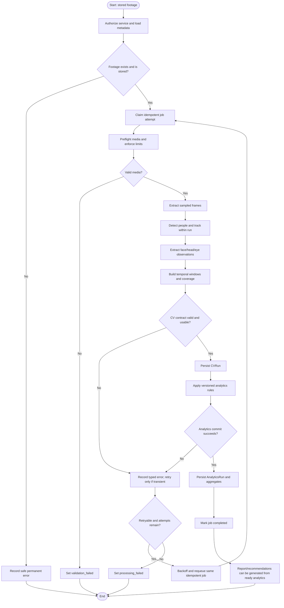

# Processing activity diagram

```mermaid
flowchart TD
  A([Start: stored footage]) --> B[Authorize service and load metadata]
  B --> C{Footage exists and is stored?}
  C -->|No| X[Record safe permanent error]
  C -->|Yes| D[Claim idempotent job attempt]
  D --> E[Preflight media and enforce limits]
  E --> F{Valid media?}
  F -->|No| G[Set validation_failed]
  F -->|Yes| H[Extract sampled frames]
  H --> I[Detect people and track within run]
  I --> J[Extract face/head/eye observations]
  J --> K[Build temporal windows and coverage]
  K --> L{CV contract valid and usable?}
  L -->|No| M[Record typed error; retry only if transient]
  L -->|Yes| N[Persist CVRun]
  N --> O[Apply versioned analytics rules]
  O --> P{Analytics commit succeeds?}
  P -->|No| M
  P -->|Yes| Q[Persist AnalyticsRun and aggregates]
  Q --> R[Mark job completed]
  R --> S[Report/recommendations can be generated from ready analytics]
  G --> T([End])
  X --> T
  M --> U{Retryable and attempts remain?}
  U -->|Yes| V[Backoff and requeue same idempotent job]
  V --> D
  U -->|No| W[Set processing_failed]
  W --> T
  S --> T
```
