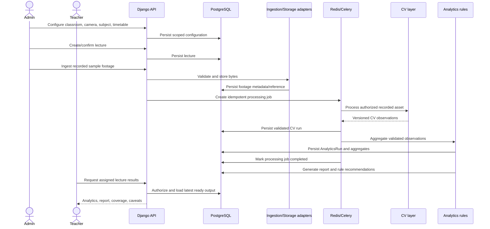

# Lecture workflow

```mermaid
sequenceDiagram
  actor Admin
  actor Teacher
  participant API as Django API
  participant DB as PostgreSQL
  participant Ingest as Ingestion/Storage adapters
  participant Queue as Redis/Celery
  participant CV as CV layer
  participant Analytics as Analytics rules
  Admin->>API: Configure classroom, camera, subject, timetable
  API->>DB: Persist scoped configuration
  Admin->>API: Create/confirm lecture
  API->>DB: Persist lecture
  Admin->>API: Ingest recorded sample footage
  API->>Ingest: Validate and store bytes
  Ingest->>DB: Persist footage metadata/reference
  API->>Queue: Create idempotent processing job
  Queue->>CV: Process authorized recorded asset
  CV-->>Queue: Versioned CV observations
  Queue->>DB: Persist validated CV run
  Queue->>Analytics: Aggregate validated observations
  Analytics->>DB: Persist AnalyticsRun and aggregates
  Queue->>DB: Mark processing job completed
  Analytics->>DB: Generate report and rule recommendations
  Teacher->>API: Request assigned lecture results
  API->>DB: Authorize and load latest ready output
  API-->>Teacher: Analytics, report, coverage, caveats
```

## End-to-end processing flow

```mermaid
flowchart LR
  Setup[Admin configures room, camera, timetable, lecture] --> Record[Recorded lecture footage]
  Record --> Ingest[Provider discovers/submits footage]
  Ingest --> Validate[Validate and store external video]
  Validate --> Queue[Create idempotent Celery job]
  Queue --> Process[CV observations]
  Process --> Aggregate[Versioned business analytics]
  Aggregate --> Report[Report + rule recommendation]
  Report --> Review[Teacher views assigned lecture results]
```

The source is recorded video; the workflow does not include live camera stream analysis.
