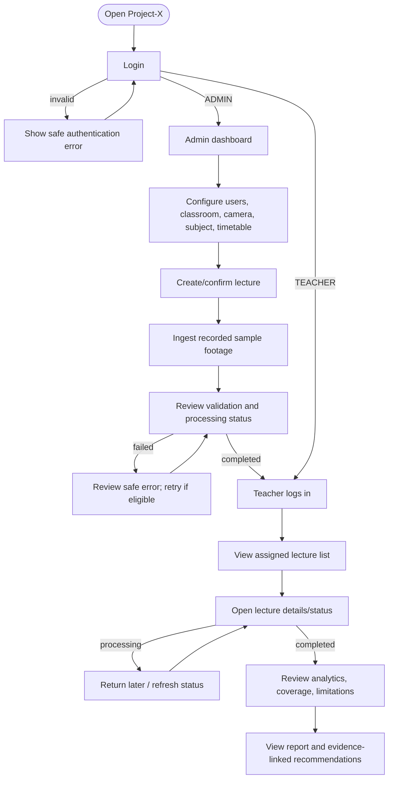

# User flow

```mermaid
flowchart TD
  Start([Open Project-X]) --> Login[Login]
  Login -->|invalid| LoginError[Show safe authentication error]
  LoginError --> Login
  Login -->|ADMIN| AdminHome[Admin dashboard]
  AdminHome --> Setup[Configure users, classroom, camera, subject, timetable]
  Setup --> Lecture[Create/confirm lecture]
  Lecture --> Upload[Ingest recorded sample footage]
  Upload --> Status[Review validation and processing status]
  Status -->|failed| Retry[Review safe error; retry if eligible]
  Retry --> Status
  Status -->|completed| TeacherPath[Teacher logs in]
  Login -->|TEACHER| TeacherPath
  TeacherPath --> List[View assigned lecture list]
  List --> Detail[Open lecture details/status]
  Detail -->|processing| Wait[Return later / refresh status]
  Wait --> Detail
  Detail -->|completed| Analytics[Review analytics, coverage, limitations]
  Analytics --> Report[View report and evidence-linked recommendations]
```

The diagram is a role-based product journey and does not imply that an admin impersonates a teacher. Both roles use the same login entry and see authorized routes/data only.
